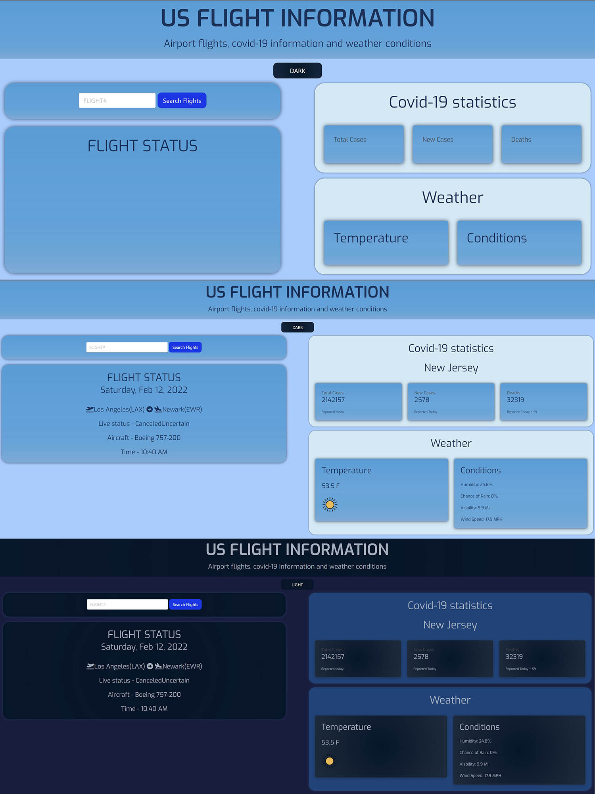

# flight-weather-app

https://github.com/johnnycarpio/flight-weather-app

https://johnnycarpio.github.io/flight-weather-app/

## About the app

The app allows the user to give a single input (Flight No.) to return multiple results.

These results include flight information as well as COVID and weather information of the destination. 

We achieved this by accessing one main API and chaining the results of said API to populate the required parameters of the following API calls.

This app is fully functional including error handlers for wrong or missing flight information.

Spinner in the Search button helps user to know if the fetch request is done.

User can also change theme from light to dark by clicking same button in the center.

## Technologies 

* HTML

* CSS

* Bulma

* JavaScript

* AeroDataBox API

* Airport-Info API

* Visual-Crossing-Weather API

* Covid-19-Statistics API

## Contributors

Johnny Carpio

Jose Lemuz

Kota Sawada

Tigran Balayan
